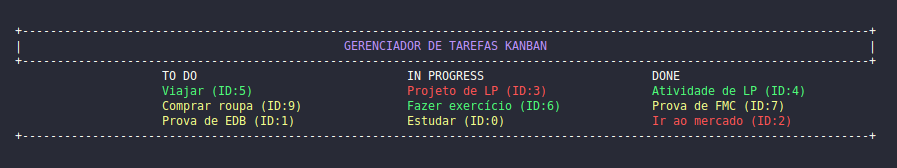
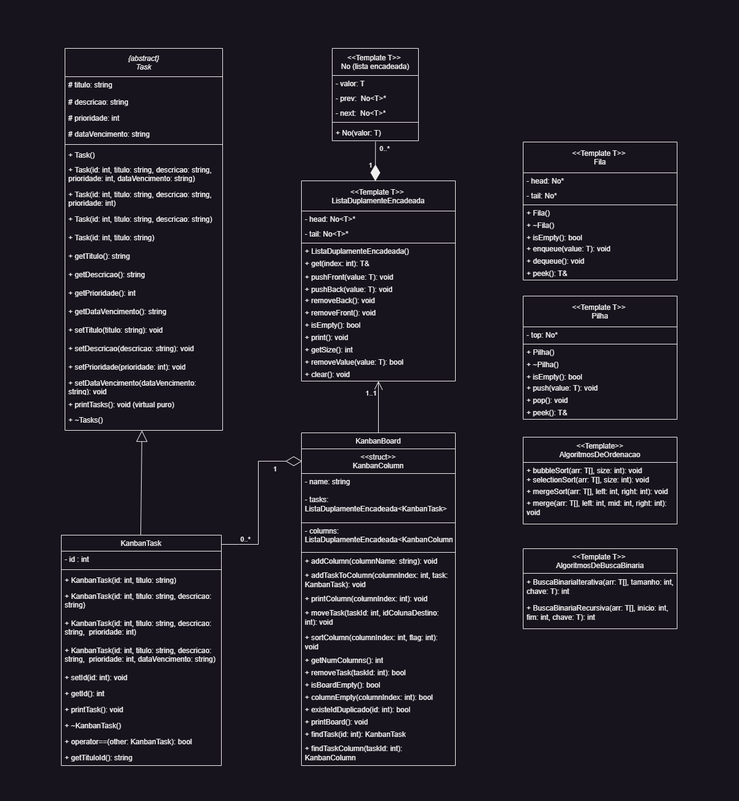

> :construction: Projeto em construção :construction:

# :clipboard: Kanban
Gerenciador de Tarefas de Metodologia Ágil com Método Kanban: Aplicativo de gerenciamento de tarefas com recursos do quadro do Método Kanban como adicionar tarefas, definir prioridades, agendar datas e classificar as tarefas usando algoritmos de ordenação.

<p align="center">
  
</p>

### ⚠️ Aviso
Este projeto utiliza o terminal para imprimir e receber dados, o que pode resultar em desalinhamentos em alguns terminais, dependendo de suas configurações individuais. Gostaríamos de ressaltar que isso é uma limitação inerente ao uso de terminais e está além do controle deste projeto. Além disso, o projeto também utiliza sequências de escape ANSI para exibir cores no terminal. No entanto, é importante notar que nem todos os terminais ou sistemas operacionais suportam totalmente a exibição de fonte colorida com ANSI. Se você encontrar problemas com a exibição das cores ou caracteres estranhos, verifique se o seu terminal é compatível com a exibição de ANSI ou considere utilizar outro terminal que suporte essa funcionalidade. Caso contrário, o texto será exibido sem as cores especificadas ou com desalinhamentos. Caso precise ajustar a largura das palavras exibidas no gerenciador, você pode modificar o espaçamento entre as colunas no arquivo [kanbanboard.cpp](include/estruturas_tads.hpp)"kanbanboard.cpp", mais precisamente no método "printBoard()". Abaixo está um trecho de código que mostra como é possível fazer essa alteração:

## Índice
- 🔨 [Funcionalidades do projeto](#-funcionalidades-do-projeto)
- 📁 [Estrutura do projeto](#-estrutura-do-projeto)
- 📊 [Diagrama de classes](#-diagrama-de-classes)
- 💻 [Técnicas e tecnologias utilizadas](#-técnicas-e-tecnologias-utilizadas)
- 🔧 [Como compilar](#-como-compilar)
- 👥 [Autores](#-autores)


# 🔨 Funcionalidades do projeto
O projeto do Gerenciador de Tarefas de Metodologia Ágil com Método Kanban possui as seguintes funcionalidades:

- **Adicionar Tarefas:** Os usuários podem adicionar novas tarefas ao quadro do Kanban, fornecendo informações como título, descrição e detalhes adicionais.

- **Definir Prioridades:** Os usuários podem atribuir prioridades às tarefas, indicando sua importância ou urgência.

- **Agendar Datas:** Os usuários podem definir datas de vencimento ou prazos para as tarefas, ajudando a acompanhar o progresso e cumprir os prazos.

- **Quadro Kanban:** O aplicativo exibirá as tarefas em um quadro Kanban, com colunas como "A fazer", "Em progresso" e "Concluído", permitindo que os usuários visualizem e gerenciem facilmente o status de cada tarefa.

- **Movimentação de Tarefas:** Os usuários poderão mover as tarefas entre as colunas do quadro Kanban, refletindo seu progresso e estágio atual.

- **Classificação de Tarefas:** O aplicativo poderá oferecer recursos de classificação de tarefas, permitindo que os usuários as organizem por prioridade, data de vencimento ou outros critérios relevantes.

- **Visualização Geral:** O aplicativo poderá oferecer uma visualização geral das tarefas, permitindo que os usuários vejam rapidamente todas as tarefas em um único local, independentemente de sua localização no quadro Kanban.

Essas funcionalidades foram desenvolvidas para melhorar a gestão de tarefas e facilitar a adoção do Método Kanban em projetos com metodologias ágeis.


# 📁 Estrutura do projeto
- **/bin:** Arquivos binários do projeto;

- **/build:** Arquivos gerados e os arquivos objetos (.o);

- **/docs:** Documentação gerada em HTML, Latex e RTF, via Doxygen, incluindo o doxyfile;

- **/imgs:** Imagens utilizada para a documentação;

- **/include:** Arquivos cabeçalhos de extensão (.hpp) e (.h);

- **/src:** Código fonte do projeto de arquivos (.cpp);

- **/tests:** Códigos para testes unitários de testes de funções (.cpp);

- **.gitignore:** Arquivo do Git para ignorar arquivos no controle de versão;

- **Makefile:** Comandos de compilação;

- **README.md:** Documentação do projeto.

# 📊 Diagrama de classes
O diagrama de classes UML é uma representação visual da estrutura e das relações entre as classes em um projeto. Ele fornece uma visão geral da organização das classes, seus atributos e métodos, bem como as associações, heranças e dependências entre elas. Este diagrama é uma ferramenta poderosa para entender a arquitetura do sistema, identificar as principais entidades e suas interações, e facilitar o desenvolvimento, a manutenção e a comunicação entre os membros da equipe. Se você deseja explorar mais detalhes do diagrama de classes [clique aqui](docs/diagramaKanban.pdf) para ser redirecionado ao arquivo PDF correspondente.

<p align="center">
  
</p>

1. **Task:** <br>
- Classe abstrata que representa uma tarefa genérica;
- Possui atributos como titulo, descricao, prioridade e dataVencimento;
- Fornece construtores para criar tarefas com diferentes combinações de atributos;
- Possui métodos getters e setters para acessar e modificar os atributos;
- Define um método virtual puro printTask() para imprimir informações da tarefa.
2. **KanbanTask:** <br>
- Subclasse de Task que representa uma tarefa específica para um Kanban;
- Adiciona o atributo ID à tarefa;
- Fornece construtores para criar tarefas Kanban com diferentes combinações de atributos;
- Possui métodos getters e setters para acessar e modificar o atributo ID;
- Implementa o método printTask() para imprimir informações específicas de tarefas Kanban.
3. **KanbanBoard:** <br>
- Representa um quadro Kanban que contém uma lista de colunas;
- Uma lista de colunas representa uma Struct com o nome da coluna e uma lista de tarefas;
- Utiliza a classe ListaDuplamenteEncadeada para armazenar as tarefas e colunas;
- Fornece métodos para adicionar, remover e gerenciar as tarefas do quadro;
- Inclui métodos para classificar as tarefas, mover tarefas entre os status e imprimir o quadro Kanban;
4. **ListaDuplamenteEncadeada<T>:** <br>
- Implementa uma lista duplamente encadeada;
- Utiliza os nós da classe No para armazenar os elementos;
- Possui ponteiros para o primeiro elemento (head) e o último elemento (tail) da lista;
- Fornece métodos para adicionar elementos no início (pushFront) e no final (pushBack) da lista;
- Inclui métodos para remover o primeiro elemento (removeFront) e o último elemento (removeBack) da lista;
- Implementa métodos para verificar se a lista está vazia (isEmpty), imprimir os elementos (print), obter o tamanho da lista - (getSize), remover um valor específico da lista (removeValue) e limpar a lista completamente (clear).
5. **Pilha<T>:** <br>
- Implementa uma pilha utilizando uma lista encadeada;
- Utiliza os nós para armazenar os elementos da pilha;
- Possui um ponteiro para o elemento do topo (top) da pilha;
- Fornece métodos para verificar se a pilha está vazia (isEmpty), adicionar um elemento no topo da pilha (push), remover o elemento do topo da pilha (pop) e obter o elemento do topo da pilha (peek).
6. **Fila<T>:** <br>
- Implementa uma fila utilizando uma lista encadeada;
- Utiliza os nós para armazenar os elementos da fila;
- Possui ponteiros para o primeiro elemento (head) e o último elemento (tail) da fila;
- Fornece métodos para verificar se a fila está vazia (isEmpty), adicionar um elemento no final da fila (enqueue), remover o elemento na frente da fila (dequeue) e obter o elemento na frente da fila (peek).
7. **AlgoritmosDeOrdenacao<T>:** <br>
- Implementa algoritmos de ordenação genéricos, como Bubble Sort, Selection Sort e Merge Sort;
- Fornece métodos para realizar a ordenação de um array.
8. **AlgoritmosDeBuscaBinaria<T>:** <br>
- Implementa algoritmos de busca binária genéricos, incluindo versões iterativas e recursivas;
- Fornece métodos para buscar um elemento em um array ordenado e retornar o índice do elemento se encontrado.

# 💻 Técnicas e tecnologias utilizadas
<br>
- C++;
- Programação Orientada a Objetos; <br>
- Doxygen;<br>
- Git e Github;<br>
- Testes unitários;<br>

## Estruturas de TADs (Tipos Abstratos de Dados)
Este assunto é implementado no arquivo [estruturas_tads.hpp](include/estruturas_tads.hpp). Consulte esse arquivo para obter mais detalhes e implementação relacionada.

- **🔗 Lista Duplamente Encadeada:**  <br>
Uma lista duplamente encadeada é uma estrutura de dados em que os nós são conectados em duas direções, por meio de ponteiros para o próximo nó e para o nó anterior. Isso significa que cada nó possui referências tanto para o nó anterior quanto para o próximo nó na sequência. Essa característica permite a navegação eficiente tanto para frente quanto para trás na lista. A lista duplamente encadeada oferece vantagens, como a capacidade de inserir e remover elementos de forma eficiente em qualquer posição, além de possibilitar a iteração reversa pelos elementos da lista. Os métodos da Lista Duplamente Encadeada são: <br>
    1. `pushFront()`: Adiciona um novo elemento no início da lista; <br>
    2. `pushBack()`: Adiciona um novo elemento no final da lista; <br>
    3. `removeFront()`: Remove o primeiro elemento; <br>
    4. `removeBack()`: Remove o último elemento da lista; <br>
    5. `get()`: Retorna o valor do índice recebido; <br>
    6. `isEmpity()`: Verifica se a lista está vazia; <br>
    7. `print()`: Imprime os elementos da lista; <br>
    8. `getSize()`: Retorna o tamanho da lista; <br>
    9. `removeValue()`: Remove um valor específico; <br>
    10. `clear()`: Remove todos os elementos da lista; <br>

- **📚 Pilha**: <br>
Uma pilha é uma estrutura de dados que segue a abordagem "último a entrar, primeiro a sair" (LIFO - Last-In-First-Out). Os elementos são inseridos e removidos apenas em uma extremidade, chamada de topo da pilha. As operações básicas em uma pilha são `"push"` para adicionar um elemento no topo, `"pop"` para remover o elemento do topo, e `"peek"` para visualizar o elemento no topo sem removê-lo.

- **🚦 Fila:** <br>
Uma fila é uma estrutura de dados linear que segue a abordagem "primeiro a entrar, primeiro a sair" (FIFO - First-In-First-Out). Os elementos são inseridos no final da fila e removidos do início da fila. As operações básicas em uma fila são `"enqueue"` para adicionar um elemento no final da fila e `"dequeue"` para remover o elemento do início da fila, e `"peek"` para visualizar o elemento na frente sem removê-lo. A fila segue um comportamento semelhante a uma fila real, onde o primeiro elemento a entrar é o primeiro a ser atendido.

## Templates
Este assunto é implementado no arquivo [templates.hpp](include/templates.hpp). Consulte esse arquivo para obter mais detalhes e implementação relacionada.
### 1. Algoritmos de Ordenação

- **Selection Sort:** <br>
O Selection Sort é um algoritmo de ordenação simples e intuitivo. Ele funciona selecionando repetidamente o elemento de menor valor da lista não ordenada e colocando-o no início da lista ordenada. Esse processo é repetido até que toda a lista esteja ordenada. O Selection Sort é eficiente para listas de tamanho pequeno a moderado, mas possui uma complexidade de tempo quadrática **O(n²)**, o que o torna menos eficiente em grandes conjuntos de dados. No entanto, sua simplicidade e facilidade de implementação o tornam uma opção viável em certos cenários.

- **Bubble Sort:** <br>
O Bubble Sort é um algoritmo de ordenação simples que percorre repetidamente a lista a ser ordenada, comparando pares de elementos adjacentes e realizando trocas se estiverem fora de ordem. Esse processo de comparação e troca é repetido até que a lista esteja completamente ordenada. O Bubble Sort possui uma complexidade de tempo de execução quadrática, ou seja, **O(n²)**, onde "n" é o tamanho da lista. Isso significa que o tempo de execução do algoritmo aumenta rapidamente à medida que o tamanho da lista aumenta.

- **Merge Sort:** <br>
O Merge Sort é um algoritmo de ordenação eficiente e baseado no princípio "dividir para conquistar". Ele divide a lista não ordenada em sublistas menores, recursivamente ordena cada sublista e, em seguida, combina as sublistas ordenadas para obter a lista final ordenada. O processo de combinação envolve mesclar duas sublistas ordenadas em uma única lista ordenada. O Merge Sort possui uma complexidade de tempo de **O(n log n)**, tornando-o adequado para lidar com grandes conjuntos de dados. Sua eficiência e estabilidade tornam o Merge Sort uma opção popular em muitas aplicações de ordenação.


### 2. Algoritmo de busca binária
A busca binária é um algoritmo eficiente para encontrar um elemento em uma lista ordenada. Ele divide repetidamente a lista ao meio e compara o elemento buscado com o elemento do meio. Se forem iguais, a busca é concluída. Caso contrário, a busca continua na metade superior ou inferior da lista, dependendo da comparação. Esse processo é repetido até encontrar o elemento ou reduzir a lista a zero. A busca binária tem uma complexidade de tempo de **O(log n)**, tornando-a mais rápida que a busca linear para listas grandes. No entanto, requer uma lista ordenada para funcionar corretamente.

# 🔧 Como compilar?
O projeto utiliza um Makefile para automatizar o processo de compilação e criação do executável. O Makefile define o compilador, as opções de compilação e os diretórios para os arquivos objeto e executável. Siga as etapas abaixo para compilar o projeto usando o Makefile fornecido:

## Pré-requisitos
Certifique-se de ter o compilador g++ instalado em seu sistema antes de prosseguir.

### Passo 1: Obtenha o código-fonte
Clone o repositório do projeto em seu ambiente local ou faça o download dos arquivos fonte em um diretório de sua escolha.

### Passo 2: Navegue para o diretório do projeto
Abra um terminal e navegue até o diretório raiz do projeto usando o comando cd:<br>
```
cd caminho/para/o/diretorio/do/projeto
```

### Passo 3: Compile o projeto
Execute o seguinte comando para compilar o projeto: <br>
```
make all
```
<br>
Isso irá compilar o código-fonte, criar os arquivos objeto (.o) na pasta "/build", e gerar o executável na pasta "/bin".

### Passo 4: Execute o programa
Após a compilação bem-sucedida, você pode executar o programa usando o seguinte comando:<br>
```
make run
```
<br>
Isso executará o programa com base no executável gerado.

## Compilando com um único comando
Execute esse comando para limpar os arquivos, compilar os arquivos novamente e, em seguida, executar o programa.
```
make build
```
<br>

## Comandos Disponíveis
`make`: <br>
Cria os diretórios necessários se ainda não existirem.

`make all`: <br>
Compila o projeto, criando os arquivos objeto e o executável. Os diretórios necessários serão criados automaticamente, se ainda não existirem.

`make run`: <br>
 Executa o programa após a compilação. Certifique-se de ter compilado o projeto antes de executar este comando.

`make build`: <br>
 O comando 'make build' compila, executa e limpa os arquivos, proporcionando um processo completo para construir e executar o programa.

`make clean`: <br>
 Remove todos os arquivos gerados durante a compilação, incluindo arquivos objeto, arquivo executável e os diretórios.

`make clean_files`:<br>
Remove apenas os arquivos gerados durante a compilação, mantendo os diretórios de build e bin.

### Em caso de dúvidas:
```
make help
```
Utilize esse comando para exibir um guia de ajuda com uma lista dos comandos disponíveis, fornecendo informações sobre como utilizar o Makefile de forma eficaz.

## Observações
- Certifique-se de que o arquivo Makefile esteja no diretório raiz do projeto antes de executar os comandos;
- Após a compilação bem-sucedida, o arquivo executável kanban será criado no diretório bin;
- Ao executar o programa com o comando make run, certifique-se de estar no diretório raiz do projeto.


# 👥 Autores

| [<br><sub>Isabela Gomes</sub>](https://github.com/cyberisa) |  [<br><sub>Matheus Vidal</sub>](https://github.com/matheusvidal21) |
| :---: | :---: |
